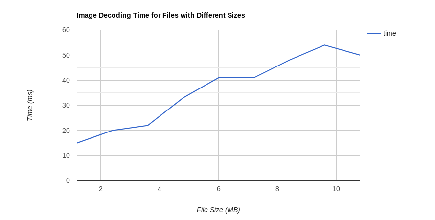

# CheckResearch.org [Experiment](https://checkresearch.org/Experiment/View/35d569a8-6353-44d7-80af-6ac08290df0b)

 Publication ["Deterministic Browser."](https://dblp.uni-trier.de/rec/html/conf/ccs/CaoCLW17) by "Yinzhi Cao, Zhanhao Chen, Song Li, Shujiang Wu"


## Experiment Setup

### Experiment Content

The experiment aimed to reproduce the timing attacks that have been described in the paper using the [Demo page for DeterFox](http://deterfox.com/#demo).

### Hardware/Software

#### Hardware:
The whole experiment has been conducted in a Virtual Machine with the following Hardware specifications:
* 2 Processor cores of a Intel Core i7-4820K
* 8 Gb of Memory
* Ethernet connection via NAT over Intel PRO/1000MT Desktop

#### Software:
* Ubuntu 18.04
* Firefox (Version 69.0)
* DeterFox (Version 51.0a1 Nightly)
    * The code for this version of DeterFox can be found in the directory [code/originalcode](./code/originalcode)

## Experiment Assumptions

Make it explicit here if you made any assumptions in your experiment

## Preconditions
Installing DeterFox proved to be a tedious task. The developers do not provide an installer or an executable that can be downloaded. They only provided a link to their [GitHub](https://github.com/nkdxczh/gecko-dev/tree/deterfox) repository where you to build the source code from scratch. This would not pose a problem had there not been so many errors in the provided files. In order to build the source code from scratch you can use the instructions on the [Mozilla Developer Portal](https://developer.mozilla.org/en-US/docs/Mozilla/Developer_guide/Build_Instructions/Simple_Firefox_build/Linux_and_MacOS_build_preparation). 

Please install the required libraries from the apt repository as described in the build instructions of the Mozilla website before executing the build.

For any normal firefox distribution the steps described on the Mozilla website would be sufficient to build the source code. However DeterFox does have some additional requirements for the build which are not described on their GitHub page.
### Additional Requirements
#### Libraries
Install the following libraries using the apt package manager:
* libasound2-dev
* libxt-dev

The build process uses the `sed` command. Please check which version of `sed` is installed on your operating system. If you have `sed` version >= 4.3 you need to perform the following preparation since these versions of `sed` do not support the `[:space:]` notation anymore. Go to ```
build/autoconf/icu.m4``` in your DeterFox root directory and replace the following the line 72 with the following:
```
version=`sed -n 's/^[[[:space:]]]*#[[:space:]]*define[[:space:]][[:space:]]*U_ICU_VERSION_MAJOR_NUM[[:space:]][[:space:]]*\([0-9][0-9]*\)[[:space:]]*$/\1/p' "$icudir/common/unicode/uvernum.h"`
```

Now go to the directory `geckodev/toolkit/crashreporter/google-breakpad/src/client/linux` and replace all occurrences of `ucontext` with `ucontext_t` inside the following files:
* handler/exception\_handler.cc
* handler/exception\_handler.h
* dump\_writer\_common/ucontext\_reader.cc
* dump\_writer\_common/ucontext\_reader.h
* microdump\_writer/microdump\_writer.cc
* minidump\_writer/minidump\_writer.cc


The build tool mach in this version of Firefox seemed to have a bug as well, which was fixed by implementing the change described in the following changeset: https://github.com/MoonchildProductions/Pale-Moon/commit/d3e2e53ed55c82b6f68b0412edea7ea92ddd83e5

Now you can start the build using the following command in the root directory of the DeterFox source:
    
    ./mach build

## Experiment Steps

The DeterFox browser has been tested and compared to a normal Firefox browser by using the [DeterFox website](http://deterfox.com/). Using the section demo the site is able to carry out three different types of timing attacks using javascript.

## Results
The following graphs clearly show that no matter how large an image or script is, the DeterFox browser always takes the same time to load or parse it, which makes it impossible to gain any additional information about an image or a script by measuring its loading time. The Firefox browser on the other hand takes longer the bigger the image or script is, which makes it vulnerable to timing attacks.

### Timing Attacks in Deterfox compared to Firefox
|SVG Filter DeterFox|SVG Filter Firefox|
|-------------------|------------------|
|||

|Script Parsing DeterFox|Script Parsing Firefox|
|-----------------------|----------------------|
|||

|Image Decoding DeterFox|Image Decoding Firefox|
|-----------------------|----------------------|
|||
